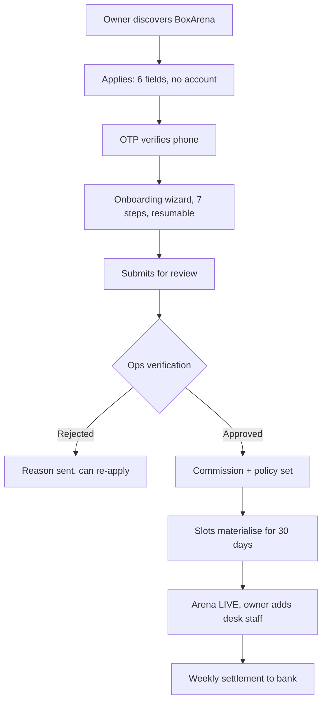

# Arena Onboarding — How a Venue Gets Registered

How a turf/court owner in Lucknow goes from "never heard of BoxArena" to "taking live bookings."

**The core principle:** an arena is *never* self-serve live. Anyone can apply in 3 minutes, but **a human verifies before a single rupee moves.** One fake or wrongly-pinned venue that takes a booking destroys the trust the whole prize loop depends on.

---

## 1. The Flow at a Glance



**Realistic timeline:** apply day 0 → ops call day 0–1 → site visit day 1–3 → live day 2–4.

---

## 2. Stage 0 — Discovery

Three entry points, all landing on `/partner`:

1. **Public site** — "List your venue" in the header and a dedicated `/partner` landing page. (PlaySpots does this well with a dual hero CTA: *"To Book Venue"* / *"To Get Listed"*.)
2. **In-app** — a "List with us" entry in the player app, exactly as Playo does. Turf owners are often players themselves.
3. **Field sales** — the real channel for the first 20 arenas. Someone walks into Gomti Nagar turfs with a phone and fills the form *with* the owner. Assume this is how launch actually happens; the self-serve flow exists to scale later, not to get you to ten venues.

The `/partner` page must answer, in order: *how much will I earn* → *what does it cost me* → *how much work is it* → *who else has joined*. Owners care about empty-slot revenue and getting paid on time — not features.

---

## 3. Stage 1 — Application (no account yet)

Six fields. Anything longer loses people standing in a turf office.

```
Owner name · Phone · Venue name · Area (Gomti Nagar…) · Sports (multi) · Number of courts
```

→ Creates an `ArenaApplication` with `status: submitted`. This exists as a separate record from `Arena` on purpose: **an application is a sales lead**, it can be abandoned, duplicated, or rejected, and it must never pollute the live arena collection.

Then phone OTP → creates `User { role: arena_owner, status: pending }`.

Ops sees the lead in the admin panel immediately, even if the owner never finishes the wizard. Half your first cohort will drop off here and get converted by a phone call — that's expected, and it's why the lead is captured before the long form.

---

## 4. Stage 2 — The Wizard (7 steps, resumable)

Saves after every step. An owner can close the browser and resume from a link; assume they're on a mid-range Android on 4G, interrupted constantly.

### Step 1 — Venue basics
Name, description, contact phone, **3–10 photos**. Photos are the single biggest driver of booking conversion — enforce a minimum of 3 and reject anything under 800px wide. Offer "we'll send a photographer" for the launch cohort; it's worth the cost.

### Step 2 — Location ← **where the Maps key earns its money**
1. Google **Places Autocomplete** on the address field (proxied through our backend, server key — never the browser key, see `edge_cases.md` §82).
2. Autocomplete returns a `place_id` → we geocode → **drop a pin on a map**.
3. **The owner must drag the pin to the actual entrance and confirm.** Google's pin for a turf is frequently 100–300m off, or on the main road instead of the gate.
4. We store `location` as GeoJSON `[lng, lat]`, plus `googlePlaceId` and `formattedAddress`.

This step decides whether "arenas near me" works at all. A wrong pin means the venue never surfaces in radius search — and the owner blames the platform. **Ops re-verifies the pin against satellite view during review.** Validate coordinates fall inside India before saving (`edge_cases.md` §78).

### Step 3 — Courts
One row per bookable surface: name (`Court 1`, `Turf A`), sport, surface type, indoor/outdoor, capacity.

This is the step owners get wrong. **"How many games can run at the same time?"** is the question to ask — not "how many courts". A shared-net badminton hall with 4 nets is 4 courts. One turf that splits into two 5-a-side pitches is 2 courts, and both must be bookable independently.

### Step 4 — Operating hours
Per day of week, with a closed toggle. Most Lucknow turfs run 06:00–23:00, some 24h. This template is what the cron materialises slots from.

### Step 5 — Pricing
Base price per court per hour, then optional bands — matching how Playo's partner app already structures it:

```
MON–FRI   06:00–09:00  ₹420      (morning)
          09:00–16:00  ₹300      (off-peak — the slots we exist to fill)
          16:00–23:00  ₹420      (peak)
SAT–SUN   all day      ₹500
HOLIDAY   all day      ₹550
```

Holiday bands resolve against a shared Indian holiday calendar plus owner-added local dates. Bands resolve by priority, most specific first, falling back to `Court.basePricePerHourPaise`.

**Show the owner a live weekly grid of computed prices before they continue.** Pricing rules are the most common source of "why did it charge that?" support tickets.

### Step 6 — Amenities, policy & booking mode
- Amenities: parking, washroom, floodlights, changing room, cafeteria, CCTV, first aid, equipment rental.
- **Cancellation policy**: free-cancellation window + partial refund %. This must match the published refund policy exactly (`compliance.md` §9).
- **Booking mode** — from the PlaySpots teardown, a real choice we'd missed:
  - `prepaid_only` — safest for us, highest friction
  - `pay_at_venue_allowed` — how Indian turf booking actually works, much higher conversion, **but creates no-show risk**

  If pay-at-venue is enabled, require a small prepaid deposit (10–20%) that's forfeited on no-show. This is the compromise that keeps conversion without handing owners empty slots. Track `noShowCount` per user and block the option after 2 no-shows in 30 days.

### Step 7 — Payout & agreement
- Bank account or UPI VPA, account-holder name, IFSC.
- PAN; GSTIN if registered.
- Commission % (pre-filled from ops, negotiable per venue — `commissionPercent` is per-arena, not global, for this reason).
- Settlement cycle (weekly, T+3 after the slot date).
- T&C acceptance with a timestamp and IP, stored on the application.

→ `status: pending_verification`.

---

## 5. Stage 3 — Ops Verification (the gate)

Nothing goes live on trust. In the admin panel, ops works a checklist:

```
□ Phone answered; owner confirms they own/operate the venue
□ Map pin matches satellite view AND the actual gate
□ Photos are of this venue (reverse-image check; not stock, not a competitor's)
□ Court count matches reality — site visit or a live video walkthrough
□ Ownership/lease document or a utility bill
□ Bank account name matches the owner or the registered business
□ Pricing is sane for the area (compare to nearby arenas)
□ Operating hours confirmed
□ Commission agreed and recorded
```

Site visits are mandatory for the first 20 arenas. Once you have local density, a video walkthrough is enough for the rest.

**Approve** → creates the real `Arena` (`isVerified: true`, `isActive: true`) + `Court` rows + `PricingRule` rows, promotes the user to a live `arena_owner`, triggers slot materialisation for 30 days, and writes an `AuditLog`.

**Reject** → structured reason, owner notified, can fix and resubmit. Never a silent dead end.

Everything here writes to `AuditLog`. When a dispute later involves a venue, you need to know who approved it and on what evidence.

---

## 6. Stage 4 — Go Live

On approval the owner gets:

1. **Partner panel access** at `/partner` — same login, role-routed.
2. **Desk staff accounts.** Owners don't sit at the counter. Playo's partner app has "Add Desk Person" with username/password precisely because the person taking bookings is an employee. `ARENA_STAFF` can view today's bookings, verify check-in codes, and block slots — but **cannot** see earnings, change pricing, or touch bank details.
3. **A printable QR + check-in code flow** for the gate.
4. **Offline booking entry** — critical and easy to miss. Arenas take walk-ins and phone bookings. If staff can't mark those slots as taken in our system, we double-book the venue and it's *our* name on the failure. This is why `Slot.status` has `blocked` and why the partner dashboard splits online vs offline bookings, exactly as Playo's does.
5. **Launch support**: listing check, a WhatsApp/Instagram announcement kit, and optionally a first-week discount funded by the platform.

---

## 7. Ongoing

**Partner dashboard** — GTV, bookings (online vs offline), occupancy %, cancellations, no-shows, upcoming settlement, rating. GTV is the headline number in Playo's partner app; owners think in revenue, so lead with it.

**Settlement** — weekly, T+3 after the slot date. `Settlement` groups bookings for a period, computes gross → commission → net → payout, holds back anything disputed. The arena sees exactly which bookings make up each payment. **Paying arenas late is the fastest way to lose them** — a turf owner who chases you twice goes back to a paper register and WhatsApp.

**Quality** — rating from post-match reviews (verified bookings only). Below 3.5 → ops call. Repeated arena-caused cancellations → temporary delisting.

---

## 8. Schema Support

Added for this flow:

| Model / field | Purpose |
|---|---|
| `ArenaApplication` | Lead → wizard → verification. Separate from live `Arena` |
| `UserRole.ARENA_STAFF` | Desk person; scoped permissions under an owner |
| `Arena.bookingMode` | `prepaid_only` \| `pay_at_venue_allowed` |
| `Arena.depositPercent` | Forfeitable deposit when pay-at-venue is on |
| `Arena.payoutAccount` | Bank/UPI for settlements |
| `Arena.settlementCycle` | `weekly` \| `fortnightly` \| `monthly` |
| `PricingRule.appliesTo` | `weekday` \| `weekend` \| `holiday` \| `specific_date` |
| `Booking.source` | `app` \| `web` \| `offline_desk` \| `walk_in` |
| `Settlement` | Periodic arena payout with the booking breakdown |
| `User.noShowCount` | Gates pay-at-venue eligibility |

---

## 9. Endpoints

```
POST   /partner/apply                     public — 6-field lead
POST   /partner/apply/:id/verify-phone    OTP
GET    /partner/application                resume in progress
PATCH  /partner/application/step/:n        save a wizard step
POST   /partner/application/submit         → pending_verification

GET    /admin/applications                 ?status=  queue
GET    /admin/applications/:id             full detail + checklist
POST   /admin/applications/:id/approve     creates Arena+Courts+Rules, materialises slots
POST   /admin/applications/:id/reject      structured reason

POST   /owner/staff                        add desk person
DELETE /owner/staff/:id
POST   /owner/bookings/offline             record a walk-in / phone booking
GET    /owner/settlements
GET    /owner/dashboard                    GTV, occupancy, cancellations
```

---

## 10. Edge Cases

1. **Duplicate venue.** Two people register the same turf. Check for an existing arena within 100m with a similar name at submit time and flag for ops. Whoever proves ownership wins; the other is rejected.
2. **Owner sells the venue.** Ownership transfer is an ops action with an audit trail, never a self-serve profile edit. Pending settlements go to the *previous* owner for slots already played.
3. **Application abandoned mid-wizard.** Keep it 30 days, nudge at day 2 and day 7, then archive. Ops should be calling these — it's the highest-intent lead list you have.
4. **Owner edits after going live.** Adding courts is fine. Removing a court, shrinking hours, or raising prices must not affect **already-booked** slots — reject the change with the conflicting bookings listed and make the owner cancel them explicitly, which triggers full refunds (`edge_cases.md` §23).
5. **Owner is also a player.** Same `User`, multiple roles. They must not be able to review their own arena, and paid challenges at their own venue need scrutiny.
6. **Bank account mismatch.** If the account name doesn't match the owner or business, hold settlement and escalate. Classic payout-fraud vector.
7. **Venue closes permanently.** Soft-delete, cancel and refund all future bookings, settle outstanding dues, keep history so past matches and stats still resolve.
