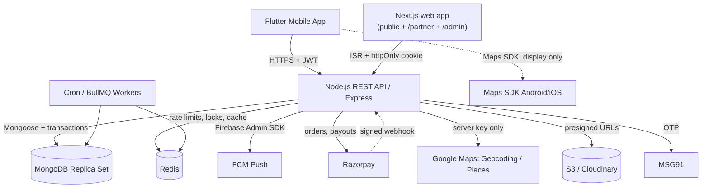

# Technical Specification — BoxArena

Architecture, standards, and component layout for the **BoxArena** multi-platform system.

**Companion documents — read in this order:**
1. `prd.md` — what we're building and why
2. `mongodb_schemas.ts` — the data contract
3. `api_contract.md` — the API contract
4. **`edge_cases.md` — the failure modes. Non-optional.**
5. `env/README.md` — third-party setup (Maps, Razorpay, Firebase, MSG91)

---

## 1. System Architecture



### Stack

| Layer | Choice |
|---|---|
| Backend | Node.js 20 LTS, Express 4, TypeScript 5, Mongoose 8 |
| Database | MongoDB 7 **as a replica set** (Atlas M0+, `ap-south-1`) |
| Cache / locks / queues | Redis 7 + BullMQ |
| Validation | Zod (request boundary **and** env boundary) |
| Auth | JWT access (15 m) + rotating refresh (30 d) in `RefreshToken` |
| Push | Firebase Cloud Messaging via Firebase Admin SDK |
| Payments | Razorpay (Orders + Webhooks); RazorpayX for payouts, Phase 2 |
| Maps | Google Maps Platform — 4 restricted keys (`env/README.md`) |
| Storage | S3 (`ap-south-1`) with presigned uploads |
| Mobile | Flutter 3.2x, Riverpod, `dio`, `go_router`, `freezed` |
| Web (public + partner + admin) | **One** Next.js App Router project, Tailwind, shadcn/ui, TanStack Query |
| Testing | Vitest/Jest + `mongodb-memory-server` (replica-set mode), Supertest |
| Observability | Sentry, pino (redacted), `/health` + `/health/ready` |

### Why Redis is not optional
Rate limiting, slot-hold locks, and geocode caching all break the moment you run more than one backend instance. In-memory state is a single-instance illusion.

---

## 2. Cross-Cutting Rules

These override any conflicting instinct while generating code.

1. **Money is integer paise.** Every field ends in `Paise`. No floats, ever.
2. **The ledger is the truth.** `User.wallet.*` is a cache. Every balance change writes a `Transaction` inside the same session.
3. **Any multi-document write that touches money uses a Mongoose session.** Booking + slot + transaction; challenge accept + two debits; match settle + payout + stats.
4. **State transitions are atomic conditional updates,** never read-then-write. `findOneAndUpdate({_id, status: <expected>}, ...)` and check for `null`.
5. **Validate at the boundary with Zod `.strict()`.** Strip unknown keys so nobody injects `role`.
6. **Every `:id` route verifies ownership.** IDOR is the most likely real vulnerability here.
7. **Idempotency keys on every financial mutation.**
8. **Notifications fire after commit,** never inside a transaction.
9. **No raw ObjectIds in URLs** — use `publicId`.
10. **No business logic in controllers.** Controllers parse and respond; services decide; repositories persist.

---

## 3. Clean Code & Layering

> Detailed, lint-enforced rules — feature boundaries, size budgets, naming, TypeScript config — live in **`code_standards.md`**. This section covers the shape; that file covers the enforcement.

### 3.1 Backend (Node/Express)

**Layers, strictly one-directional** (inside each feature module):
```
route → middleware(validate, auth) → controller → service → repository → model
```
- **Controllers**: parse `req`, call one service method, shape the response. No `await Model.find()` here, ever.
- **Services**: business logic, transactions, invariants. Pure of Express — they never see `req`/`res`, which makes them testable and reusable from cron workers.
- **Repositories**: all Mongoose access. Lets you mock persistence in service tests.
- **Errors**: `AppError` base + `BadRequestError`, `UnauthorizedError`, `ForbiddenError`, `NotFoundError`, `ConflictError`, `RateLimitError`. Each carries a machine-readable `code` from `api_contract.md`. One global error middleware converts them to the standard envelope and logs. Never leak stack traces in production.
- **Transaction helper**: wrap the session boilerplate once.
  ```ts
  export async function withTransaction<T>(fn: (s: ClientSession) => Promise<T>): Promise<T> {
    const session = await mongoose.startSession();
    try { return await session.withTransaction(() => fn(session)); }
    finally { await session.endSession(); }
  }
  ```
  `withTransaction` retries on transient errors automatically — so the callback must be **idempotent and side-effect-free** (no push notifications, no emails inside it).
- **Env validation**: a single `config/env.ts` parses `process.env` through Zod and exports a typed frozen object. Nothing else in the codebase reads `process.env`. Crash on invalid config.

### 3.2 Flutter

Feature-first Clean Architecture:
```
lib/features/<feature>/
  data/        datasources (remote/local), DTOs, repository impls
  domain/      entities, repository interfaces, use-cases
  presentation/ providers (Riverpod), screens, widgets
```
- `dio` interceptor attaches the JWT, refreshes on 401 behind a **single-flight mutex** (edge case 109), and maps error envelopes to typed failures.
- Use `freezed` + `json_serializable` for DTOs; never hand-write `fromJson`.
- Money: keep as `int` paise end-to-end; format only in a `MoneyText` widget using Indian digit grouping.
- Never trust local state after a financial action — re-fetch.
- One `AppTheme`; no hard-coded colours or text styles in screens.

### 3.3 Next.js (Web + Admin)

- Server Components for data fetching; Client Components only where interactivity demands it.
- Public site: ISR (`revalidate: 300`) on arena and leaderboard pages for SEO.
- Admin: httpOnly cookie sessions (**never** localStorage), `middleware.ts` for role + IP gating.
- Shared UI in `/components/ui` (shadcn), data hooks in `/hooks` (`useWallet`, `useDisputes`).
- Money formatting helper shared with the mobile logic in intent: paise → `₹1,23,456.50`.

---

## 4. Directory Layouts

### 4.1 Backend — feature modules

Organised by **feature**, not by layer. Adding "cancel a booking" touches one folder. Full rules and the lint enforcement: `code_standards.md §1`.

```text
backend/src/
├── modules/
│   ├── auth/            auth.{routes,controller,service,repository,validators,types}.ts
│   │                    + auth.service.test.ts + index.ts (public API)
│   ├── arenas/          incl. courts, pricing rules, geo search
│   ├── booking/         slots, holds, bookings, cancellation
│   ├── wallet/          ledger, buckets, withdrawals
│   ├── payments/        Razorpay orders, webhooks, reconciliation
│   ├── teams/           teams, invites
│   ├── challenges/      escrow, matchmaking
│   ├── matches/         scoring, ScoreValidator, EloService
│   ├── disputes/
│   ├── notifications/
│   ├── partner/         onboarding wizard, owner panel, staff
│   ├── settlements/
│   └── admin/
├── models/              all 23 Mongoose schemas (shared across modules)
├── shared/
│   ├── config/          env.ts (Zod), db.ts, redis.ts, firebase.ts, razorpay.ts, logger.ts
│   ├── errors/          AppError + subclasses
│   ├── middlewares/     auth, requireRole, validate, idempotency, rateLimit, rawBody, errorHandler
│   ├── utils/           money.ts, ids.ts, datetime.ts, transaction.ts
│   └── types/
├── jobs/                cron/BullMQ workers — import services from modules
├── app.ts
└── server.ts
```

**Boundaries:** a module imports another only through its `index.ts`; `shared/` never imports a module. Layering inside a module stays strict — `routes → controller → service → repository → model`, with services free of Express so cron jobs can call them.

### 4.2 Flutter
```text
flutter_app/lib/
├── core/
│   ├── config/          env, flavors
│   ├── network/         api_client.dart, interceptors, error_mapper.dart
│   ├── router/          go_router + deep links
│   ├── theme/           app_theme.dart, colors.dart, typography.dart
│   ├── widgets/         ArenaButton, MoneyText, LoaderOverlay, EmptyState
│   └── utils/           money_format.dart, date_format.dart
├── features/
│   ├── auth/  arenas/  booking/  teams/  challenges/  matches/  wallet/
│   │   profile/  leaderboard/  notifications/
│   └── (each: data/ domain/ presentation/)
└── main.dart
```

### 4.3 Web — ONE Next.js app, three audiences

Public site, arena partner panel, and ops admin all live in a **single Next.js project**, separated by route groups and gated by `middleware.ts`. One codebase, one deploy, one design system, one set of shared components.

```text
web/
├── app/
│   ├── (public)/                    boxarena.in — no auth
│   │   ├── page.tsx                 landing: dual CTA (Book / List your venue)
│   │   ├── arenas/[slug]/           SEO arena pages (ISR)
│   │   ├── leaderboard/
│   │   ├── matches/[publicId]/      shareable result pages + OG images
│   │   ├── players/[publicId]/
│   │   ├── partner/                 "list your venue" pitch + application wizard
│   │   └── legal/                   terms, privacy, refunds, responsible gaming
│   ├── (auth)/login/                one login, role-routed after
│   ├── partner/                     role: arena_owner | arena_staff
│   │   ├── dashboard/               GTV, occupancy, cancellations
│   │   ├── bookings/                incl. offline/walk-in entry + check-in
│   │   ├── courts/  hours/  pricing/
│   │   ├── staff/                   owner only — desk person accounts
│   │   └── settlements/             owner only
│   ├── admin/                       role: admin | super_admin
│   │   ├── applications/[id]/       arena verification queue
│   │   ├── disputes/[id]/
│   │   ├── users/  withdrawals/  arenas/
│   │   ├── reconciliation/  config/  audit/
│   │   └── settlements/
│   └── api/                         BFF route handlers (cookie -> bearer)
├── features/                        # arenas, booking, wallet, teams, challenges,
│   └── <feature>/{api,components,hooks,types.ts,utils.ts,index.ts}
├── shared/{ui,lib,hooks,types}/     # ui = design-system primitives ONLY
└── middleware.ts                    role gate + IP allowlist on /admin
```

`app/` holds **routing only** — it composes feature components and contains no business logic. Feature boundaries are lint-enforced (`code_standards.md §1.4`).

**Routing rule:** `middleware.ts` matches `/partner/*` and `/admin/*`, reads the session cookie, and redirects on insufficient role. Server Components re-verify role on every data fetch — middleware is a UX convenience, **never** the security boundary. Ownership scoping (an owner sees only their arenas) is enforced in the backend service layer regardless.

**The security trade-off, stated plainly.** Separate origins are safer: an XSS on the marketing site cannot reach an admin session. Consolidating means one origin, so that isolation is gone. It is a reasonable trade for a small team — one deploy, one component library, one auth flow — provided you add these compensating controls, which are not optional:

1. **Strict CSP** with nonces, no `unsafe-inline`, no `unsafe-eval`.
2. **httpOnly + Secure + SameSite=Strict** session cookies, scoped `Path=/admin` and `Path=/partner` so the public site cannot read them even if the origin is shared.
3. **Separate short-lived sessions per surface** — 8h for partner, 8h with re-auth for admin, and no session at all on public pages.
4. **2FA required for `admin` and `super_admin`.**
5. **No user-generated HTML rendered anywhere.** Arena descriptions, team names, and dispute notes are plain text, escaped.
6. **Optional `/admin` IP allowlist** in middleware for production.

If the business later takes real money at volume, split `/admin` to `admin.boxarena.in` as its own deploy. The route-group layout above makes that a folder move, so the decision stays reversible.

---

## 5. Key Subsystems

### 5.1 Slot booking (the concurrency core)
Two-phase: **hold** then **confirm**.
1. `POST /bookings/hold` — atomic conditional update per slot, sorted by `startAt`, all-or-nothing in one session. Sets `holdExpiresAt = now + 5m`.
2. `POST /bookings` — validates the hold still belongs to the caller, charges wallet or gateway, flips slots to `booked`, writes the `Booking` + `Transaction`.
3. `releaseExpiredHolds` cron reclaims abandoned holds every 60s.

Unique index `{courtId, startAt}` is the final guarantee. Full rules: `edge_cases.md` §2.

### 5.2 Wallet
Three buckets (`deposit`, `winnings`, `bonus`) + `lockedPaise`. Debit order `bonus → deposit → winnings`; a single charge may produce several `Transaction` rows. Withdrawals draw from `winnings` only, KYC-gated, TDS computed. Nightly reconciliation asserts `sum(ledger) == balance` and freezes accounts on drift.

### 5.3 Score verification
```
submit → validate sport rules → normalise to creator's perspective → store submission
  ├── first submission  → PENDING_CONFIRMATION, set confirmationDeadline (+24h), notify opponent
  ├── second, matching  → VERIFIED → settle payout + ELO + stats (one transaction)
  ├── second, differing → DISPUTED → create Dispute (SLA 48h), hold escrow, notify admins
  └── deadline passes   → auto-accept the single submission, ADMIN_RESOLVED, settle
```
**Perspective normalisation is the subtle part**: `21-18` from the creator and `18-21` from the opponent describe the *same* result. Normalise before comparing or every honest match becomes a dispute (edge case 56).

Badminton validity (enforced in `ScoreValidator`): game to 21, win-by-2 after 20-all, hard cap 30, best-of-3, 2 or 3 games only, no draws.

### 5.4 ELO
Standard Elo, K=32, seeded at 1200, tracked per `{user, sport, format}` so singles and doubles rate independently. Computed from ratings snapshotted at match start, stored in `Match.eloDelta` as before/after. Voided matches never touch ratings.

### 5.5 Maps & geo
`Arena.location` is GeoJSON `[lng, lat]` with a `2dsphere` index; `/arenas/nearby` uses `$near`. Geocoding and Places autocomplete are **proxied through the backend** (`/geo/*`) with the IP-restricted server key and a 30-day cache — client keys are extractable from any APK. Behind a `GeoService` interface so Mappls/Ola can be swapped in. See `env/README.md` and `edge_cases.md` §7.

### 5.6 Notifications
Write a `Notification` row (the in-app inbox is the source of truth), then attempt FCM multicast. Prune tokens returning `UNREGISTERED`. Never send inside a transaction; never put amounts or OTPs in the payload.

---

## 6. Security Baseline

- `helmet`, CORS with an explicit origin list, `express-rate-limit` on Redis.
- Zod `.strict()` everywhere; `mongoose.set('sanitizeFilter', true)`.
- Re-read `role` and `status` from the DB on privileged routes — a JWT issued before suspension is still valid.
- Razorpay webhooks: HMAC verified against the **raw** body, on a raw-body-parsed route only.
- Uploads: magic-byte validation, 5 MB cap, EXIF stripped, presigned, separate origin.
- Redact `password, otp, code, token, authorization, signature, accountNumber, pan` at the logger.
- Admin panel: httpOnly cookies, 2FA, optional IP allowlist, dual approval above ₹10,000, `AuditLog` on every mutation.
- Secrets from a manager (AWS Secrets Manager / Doppler) in production, not a `.env` on disk.

---

## 7. Testing Strategy

Integration tests run against `mongodb-memory-server` **in replica-set mode** — transactions silently no-op otherwise, which would make the wallet tests pass while the code is broken.

Priority order:
1. Concurrency: parallel bookings, parallel challenge accepts, parallel wallet debits.
2. Money invariants: ledger sum == balance after N randomised operations.
3. Score validation: the badminton table in `edge_cases.md` §5, including `30-28` reject and `21-18 / 18-21` match.
4. Authorization: cross-tenant reads must 403.
5. Webhook idempotency: same event delivered 3× credits once.

The checklist in `edge_cases.md` §11 is the definition of done.

---

## 8. Environments & Deployment

| Env | API | DB | Payments |
|---|---|---|---|
| local | `localhost:5000` | local replica set | mock |
| staging | `api-staging.boxarena.in` | Atlas M0 | Razorpay test |
| prod | `api.boxarena.in` | Atlas M10+ | Razorpay live |

- Backend: Docker → Railway / Render / ECS. `TZ=UTC`. Graceful `SIGTERM` handling.
- Web: Vercel, **one project**. `boxarena.in` serves the public site, `/partner`, and `/admin` (§4.3).
- Workers run as a **separate process** from the API — a slow cron must not block request handling.
- Mongo backups: Atlas continuous + a weekly restore drill. An untested backup is not a backup.
- CI: typecheck → lint → test → build; block merge on failure.
